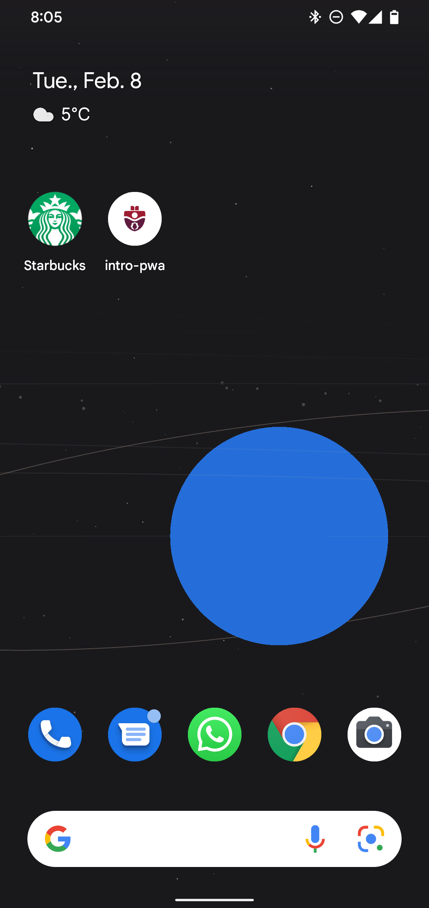
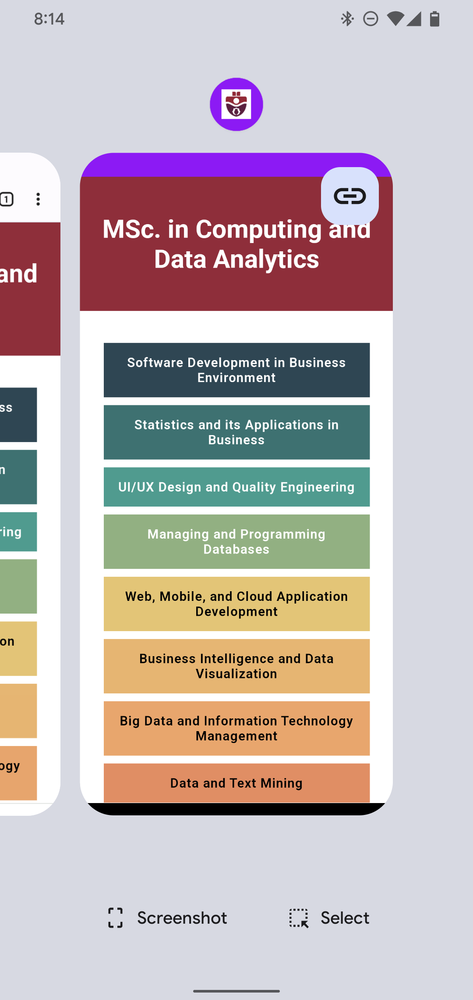

# Introduction to coding a PWA

- A PWA is an **enhanced** web app (website).
- Service worker is javascript code that runs in the background.
- App manifest is a JSON file that has information about the app.

## To run this app
Run `npm run start` to start the app with [`http-server`](https://github.com/http-party/http-server#readme).  

## Manifest 
App manifest makes your Web App installable, thus a **Progressive** Web App. Normally this file is named `manifest.json`.

The JSON file is one object having the following properties (in any order): 
```
{
  "name": "A simple PWA for MCDA5550",            -> long name
  "short_name": "intro-pwa",                      -> short name
  "description": "Creating a PWA is very easy!",  -> (shown when you add to favorite) 
  "start_url": "/",                               -> the main page that loads on stratup
  "scope": ".",                                   -> included pages (. means *all* the current directory)
  "display": "standalone",                        -> standalone meaning to look and feel like a native app  (opposed to `browser`)
  "background_color": "#FFFFFF",                  -> color on splash screen and while loading
  "theme_color": "#9900FE",                       -> theme color (ex. on the top bar)
  "orientation": "portrait",                      -> set and/or enforce the default orientation (portrait/landscape)
  "dir": "ltr",                                   -> read direction of the app
  "lang": "en-CA",                                -> main language of the app
  "icons": [                                      -> configure icons (browser will choose its better choice)
    {
      "src": "/icons/smu-icon.png",
      "sizes": "512x512", 
      "type": "image/png"
    },
    // ...
  ]
}
```

When you add the manifest file – **and you refer it in the HTML**, you can see it in the Chrome Dev Tool under the Application tab. 

*Note that sometimes you'd need to clear the cache to see the change*.


You should see your app on your phone like this: 

<div style="display: flex">
    
    
    
</div>


